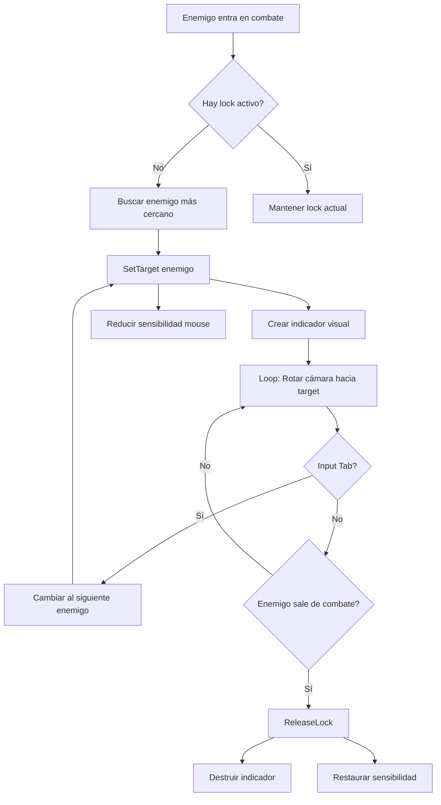

# 🎯 Sistema de Camera Targeting de Combate - Resumen

## ✅ ¿Qué se Implementó?

Sistema completo de **lock-on de cámara** para combate que:

1. **Detecta automáticamente** cuando entras en combate
2. **Hace lock** al enemigo más cercano
3. **Mantiene la cámara enfocada** en el enemigo durante la batalla
4. **Permite cambiar** de objetivo con Tab
5. **Se desactiva automáticamente** al salir de combate

## 🎮 Experiencia del Jugador

### Antes (Sin Targeting)
```
Jugador entra en combate
  → Debe mover el mouse constantemente para mantener al enemigo en vista
  → Pierde de vista al enemigo al esquivar/moverse
  → Difícil pelear contra múltiples enemigos
```

### Ahora (Con Targeting)
```
Jugador entra en combate
  → ¡AUTOMÁTICAMENTE la cámara hace lock al enemigo!
  → Indicador visual aparece sobre el enemigo
  → La cámara sigue al enemigo automáticamente
  → Presionar Tab para cambiar de enemigo
  → Al salir de combate, vuelve a cámara normal
```

## 🎬 Demo Visual

```
     JUGADOR                    ENEMIGO (Boss/NPC)
        🧙                           👹
         \                          /
          \    [COMBATE INICIA]    /
           \                      /
            \    📷 CÁMARA       /
             \   hace LOCK →    /
              \                /
               ↘              ↙
                  🎯 ¡LOCK!
                  
    [Indicador Rojo Girando]
           ⭕
           👹
           
    Cámara sigue al enemigo:
    
    Enemigo se mueve ←      → Cámara rota ←
    Enemigo salta ↑         → Cámara ajusta pitch ↑
```

## 📦 Archivos Nuevos

### 1. `CombatCameraTargeting.cs`
**Ubicación**: `Assets/Scripts/Camera/`

El sistema principal que:
- Escucha eventos de combate
- Gestiona el lock/unlock
- Controla la rotación de la cámara
- Maneja el input (Tab, Escape)

### 2. `CombatLockIndicator.cs`
**Ubicación**: `Assets/Scripts/Camera/`

El indicador visual que:
- Dibuja un círculo rojo alrededor del enemigo
- Rota constantemente
- Efecto de pulso animado
- Se destruye al cambiar/liberar lock

### 3. Método Agregado en `vThirdPersonCamera.cs`
```csharp
public void LookAtPosition(Vector3 targetPosition, bool smooth = true)
```
Permite que sistemas externos controlen la rotación de la cámara.

## 🔌 Integración con Sistemas Existentes

### ActiveCombatRegistry ✅
```csharp
ActiveCombatRegistry.OnNPCEnteredCombat += OnNPCEnteredCombat;
ActiveCombatRegistry.OnNPCExitedCombat += OnNPCExitedCombat;
```
Se suscribe a los eventos para detectar automáticamente combate.

### vThirdPersonCamera ✅
```csharp
thirdPersonCamera.LookAtPosition(targetPoint, smooth: true);
```
Usa el nuevo método para controlar la rotación.

### PlayerService ✅
```csharp
PlayerService.TryGetGameObject(out var player);
```
Obtiene referencia al jugador automáticamente.

## 🎯 Configuración Rápida (3 pasos)

### Paso 1: Agregar Componente
```
1. Seleccionar GameObject de la cámara (el que tiene vThirdPersonCamera)
2. Add Component → Combat Camera Targeting
3. ¡Listo! Auto-detecta todas las referencias
```

### Paso 2: Ajustar Configuración (Opcional)
```
En el Inspector:
├─ Max Lock Distance: 30m
├─ Targeting Rotation Speed: 8
├─ Target Height Offset: 1.5m
└─ Show Debug Logs: ✅ (para testing)
```

### Paso 3: Crear Indicador Visual (Opcional)
```
1. GameObject vacío → Add Component: Combat Lock Indicator
2. Configurar color y tamaño
3. Guardar como Prefab
4. Asignar en CombatCameraTargeting
```

## 🎮 Controles (Gamepad/Mando)

| Input | Acción |
|-------|--------|
| **Automático** | Lock al entrar en combate |
| **D-Pad Right →** | Cambiar al siguiente enemigo |
| **D-Pad Left ←** | Cambiar al enemigo anterior |
| **Automático** | Release al salir de combate |

> **Nota**: El sistema está diseñado para gamepad/mando, no para teclado/ratón.
> El lock se libera automáticamente al salir de combate, no hay botón de cancelar manual.

## 📊 Flujo de Ejecución



## 🔍 Verificación de Funcionamiento

### Testing Checklist

1. ✅ Iniciar combate con un NPC/Boss
2. ✅ Verificar que aparece el indicador sobre el enemigo
3. ✅ Mover al jugador → la cámara debe seguir al enemigo
4. ✅ Presionar **D-Pad Right** (si hay múltiples enemigos) → debe cambiar al siguiente target
5. ✅ Presionar **D-Pad Left** → debe cambiar al target anterior
6. ✅ Salir de combate → el lock debe liberarse automáticamente

### Logs Esperados (con Debug activado)

```
[CombatCameraTargeting] 🎯 Entrando en combate - Buscando objetivo para lock
[ActiveCombatRegistry] GetClosestCombatNPC: Buscando entre 1 NPCs
[CombatCameraTargeting] 🎯 Lock establecido en: PBR_Golem(Clone)
[CombatCameraTargeting] D-Pad Right presionado - Cambiando al siguiente enemigo
[CombatCameraTargeting] 🔄 D-Pad Right: Cambiando target → Enemy2
[CombatCameraTargeting] 🏳️ Saliendo de combate - Liberando lock
[CombatCameraTargeting] 🔓 Lock de cámara liberado
```

## 🎨 Personalización

### Cambiar Velocidad de Rotación
```csharp
public float targetingRotationSpeed = 8f; // Más alto = más rápido
```

### Cambiar Distancia Máxima de Lock
```csharp
public float maxLockDistance = 30f; // En metros
```

### Cambiar Color del Indicador
```csharp
// En CombatLockIndicator
public Color ringColor = new Color(1f, 0.3f, 0.3f, 0.8f); // Rojo
```

### Desactivar Reducción de Sensibilidad
```csharp
// En SetTarget(), comentar estas líneas:
// thirdPersonCamera.xMouseSensitivity = originalCameraSensitivity * 0.3f;
```

## 🚀 Próximos Pasos Recomendados

### Mejoras Opcionales

1. **Indicador en UI** (en lugar de 3D)
   - Más visible en pantalla
   - No se oculta detrás de objetos

2. **Priorización de Targets**
   - Bosses tienen prioridad sobre enemigos normales
   - Enemigos que atacan tienen prioridad sobre los que patrullan

3. **Soft Lock**
   - El lock se mantiene solo si miras cerca del enemigo
   - Más libertad de cámara, menos "pegajoso"

4. **Gamepad Support**
   - Stick derecho para cambiar de target
   - Trigger derecho para toggle lock on/off

## 📝 Notas Técnicas

### Performance
- ✅ Usa `ActiveCombatRegistry` (HashSet eficiente)
- ✅ Solo actualiza cuando hay lock activo
- ✅ Limpieza automática de referencias null

### Compatibilidad
- ✅ Funciona con Invector Third Person Camera
- ✅ Respeta cinemáticas (`lockCameraForCinematic`)
- ✅ Compatible con sistema de diálogos

### Thread-Safety
- ✅ Todo en main thread (MonoBehaviour)
- ✅ No usa async/await
- ✅ No hay race conditions

## 🎉 ¡Resultado Final!

Ahora cuando pelees contra un boss o NPC:

1. 🎯 La cámara hace **lock automático**
2. 👁️ Siempre mantienes al enemigo **en vista**
3. ⚔️ Puedes concentrarte en **esquivar y atacar**
4. 🔄 Cambias fácilmente entre **múltiples enemigos**
5. 🎮 Experiencia de combate **mucho más fluida**

---

## 🆘 ¿Necesitas Ayuda?

Consulta la **Guía Completa**: `GUIA_SISTEMA_CAMERA_TARGETING_COMBATE.md`

- Setup detallado paso a paso
- API completa documentada
- Troubleshooting
- Personalización avanzada
- Ejemplos de código
